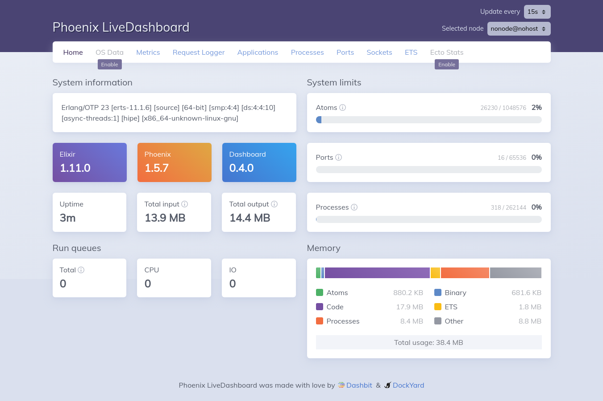

# NLW#4 :rocket:

- [x] [Segunda (22/02/2021) - Trilha Elixir - Rumo ao Próximo Nível](#segunda-22022021)
- [x] [Terça (23/02/2021) - A incrível dupla Phoenix e Ecto](#terça-23022021)
- [ ] [Quarta (24/02/2021) - Indo mais alto](#quarta-24022021)
- [ ] [Quinta (25/02/2021) - Aprofundando nosso conhecimento](#quinta-25022021)
- [ ] [Sexta (26/02/2021) - Autenticação e Testes](#sexta-26022021)


<br>

<br>

<br>

## Segunda (22/02/2021)

- **Instalação do ambiente de desenvolvimento**

  - Elixir

  - Phoenix

    ```shell
    mix archive.install hex phx_new 1.5.7
    ```

  - Docker

    ```docker
    sudo systemctl start docker
    sudo systemctl enable docker
    docker version
    ```

  - Postgres

  ```shell
  sudo docker run --name postgres -e POSTGRES_PASSWORD=postgres -p 5432:5432 -d postgres
  ```

  

- Mão na massa

```shell 
mix phx.new rocketpay --no-webpack --no-html
```

Resultado

```shell
We are almost there! The following steps are missing:

    $ cd rocketpay

Then configure your database in config/dev.exs and run:

    $ mix ecto.create

Start your Phoenix app with:

    $ mix phx.server

You can also run your app inside IEx (Interactive Elixir) as:

    $ iex -S mix phx.server

```

- Configurações do ElixirLS *(Extensão do Code)*

Desabilitar o *Dialyzer*

Arquivo mix.exs, add do Credo

```elixir
defp deps do
    [
      {:phoenix, "~> 1.5.7"},
      {:phoenix_ecto, "~> 4.1"},
      {:ecto_sql, "~> 3.4"},
      {:postgrex, ">= 0.0.0"},
      {:phoenix_live_dashboard, "~> 0.4"},
      {:telemetry_metrics, "~> 0.4"},
      {:telemetry_poller, "~> 0.4"},
      {:gettext, "~> 0.11"},
      {:jason, "~> 1.0"},
      {:plug_cowboy, "~> 2.0"},
      {:credo, "~> 1.5", only: [:dev, :test], runtime: false}
    ]
  end
```

- Configurações da aplicação

/config/dev.exs

- Verificando o banco de dados

```shell
 mix ecto.setup
```

- Baixar todas as dependencias da aplicação

```shell
mix deps.get
```

- Validar Credo

```shell
mix credo gen.config
```

- No arquivo `.credo.exs`

```shell
{Credo.Check.Readability.ModuleDoc, []},
```

mudar para

```shell
{Credo.Check.Readability.ModuleDoc, false},
```

- Rodar o projeto. Executa o servidor da aplicação

```shell
mix phx.server
```

- No navegador: http://localhost:4000/dashboard/home



- Divisão de pastas e conteúdo no projeto

Dentro da pasta **lib** possui duas outras pastas com a separação do projeto em rotas e conexões com o banco e regras de negócio.

> ​	rocketpay
>
> ​	rocketpay_web

- Criação de Rotas

No arquivo router.ex

```elixir
 scope "/api", RocketpayWeb do
    pipe_through :api
    
    get "/", WelcomeController, :index
 end
```

**Controller**

/lib/rocketpay_web/controllers/welcome_controller.ex

```elixir
defmodule RocketpayWeb.WelcomeController do
  use RocketpayWeb, :controller

  def index(conn, _params) do
    text(conn, "Welcome to the Rocketpay API")
  end

end
```

- Módulo para ler os dados de um arquivo e exibir

Na raiz do projeto criar arquivo `numbers.csv`

- Para a lógica de negócios

Pasta rocketpay, criar arquivo numbers.ex

```
\lib\rocketpay\numberx.ex
```

```elixir
defmodule Rocketpay.Numbers do
  def sum_from_file(filename) do
    file = File.read("#{filename}.csv")
  end
end
```


Comando `iex` - Interactive Elixir

Dentro do projeto

```shell 
iex -S mix

Rocketpay.Numbers.sum_from_file("numbers")
```

Para recompilar o código

```shell 
recompile
```

- Pattern Matching no Elixir

https://elixir-lang.org/getting-started/pattern-matching.html

```elixir
defmodule Rocketpay.Numbers do
  def sum_from_file(filename) do
    file = File.read("#{filename}.csv")
    handle_file(file)
  end

  defp handle_file({:ok, file}), do: file
  defp handle_file({:error, _reason}), do: {:error, "Invalid File"}
end
```

*para...*

```elixir
defmodule Rocketpay.Numbers do
  def sum_from_file(filename) do
    "#{filename}.csv"
    |> File.read()
    |> handle_file()
  end

  defp handle_file({:ok, file}), do: file
  defp handle_file({:error, _reason}), do: {:error, "Invalid File"}
end
```

https://hexdocs.pm/elixir/Kernel.html#%7C%3E/2

- Separando Strings

`String.split("1, 2, 3, 4, 8, 9, 10", ",")`

Percorrer todos os elementos de uma lista e executar uma função

Para consultar as funções dentro do Elixir, no caso **String** `String` + `.` + `Tecla espaço`

Para documentação colocar o `h` antes

```elixir
iex(3)> h String 
```

- Utilizando o map `%{}`

```elixir
Enum.map(lista, fn number -> String.to_integer(number) end)
```

 ```elixir
Enum.sum()
 ```

Fica assim...

```elixir
defmodule Rocketpay.Numbers do
  def sum_from_file(filename) do
    "#{filename}.csv"
    |> File.read()
    |> handle_file()
  end

  defp handle_file({:ok, result}) do
    result =
      result
      |> String.split(",")
      |> Enum.map(fn number -> String.to_integer(number) end)
      |> Enum.sum()
    {:ok, %{result: result}}
  end

  defp handle_file({:error, _reason}), do: {:error, "Invalid File"}
end
```

Resumindo... 

Com o pipe operator

```elixir
Rocketpay.Number.sum_from_file("numbers")
```

fica assim

```elixir
"numbers" |> Rocketpay.Number.sum_from_file()
```

- Alias

```elixir 
alias Rocketpay.Numbers
```

a função fica só `Numbers`

- Utilizando Stream

```elixir
  defp handle_file({:ok, result}) do
    result =
      result
      |> String.split(",")
      |> Stream.map(fn number -> String.to_integer(number) end)
      |> Enum.sum()
    {:ok, %{result: result}}
  end
```

- Teste Automatizado

`/test/rocketpay/numbers_test.exs`

```elixir
defmodule Rocketpay.NumbersTest do
  use ExUnit.Case
  alias Rocketpay.Numbers

describe "sum_from_file/1" do
    test "when there is a file with the given name, returns the sum of numbers" do
      response = Numbers.sum_from_file("numbers")
      expected_response = "banana"
      assert response == expected_response
    end
  end
end
```

No terminal, arrumar as variáveis de retorno.

```shell
mix test
```

```elixir
defmodule Rocketpay.NumbersTest do
  use ExUnit.Case

  alias Rocketpay.Numbers

  describe "sum_from_file/1" do
    test "when there is a file with the given name, returns the sum of numbers" do
      response = Numbers.sum_from_file("numbers")
      expected_response = {:ok, %{result: 37}}
      assert response == expected_response
    end

    test "when there is no file with the given name, returns the sum of numbers" do
      response = Numbers.sum_from_file("banana")
      expected_response = {:error, %{message: "Invalid File"}}
      assert response == expected_response
    end

  end
end
```

- Código da aula

#rumoaoproximonivel

<br>

<br>

<br>

## Terça (23/02/2021)

***A incrível dupla Phoenix e Ecto***

Verficando...`mix ecto.create`

Ecto -> Banco de Dados

```bash
mix ecto.create

#Criando migration
mix ecto.gen.migration create_user_table
```

Em migrations, no projeto

```elixir
defmodule Rocketpay.Repo.Migrations.CreateUserTable do
  use Ecto.Migration

  def change do
    create table :users do
      add :name, :string
      add :age, :integer
      add :email, :string
      add :password_hash, :string
      add :nickname, :string

      timestamps()
    end

    create unique_index(:users, [:email])
    create unique_index(:users, [:nickname])
  end
end

```


No terminal

```shell
mix ecto.migrate

#log do comando

22:58:40.293 [info]  == Running 20210227222119 Rocketpay.Repo.Migrations.CreateUserTable.change/0 forward

22:58:40.297 [info]  create table users

22:58:40.456 [info]  create index users_email_index

22:58:40.533 [info]  create index users_nickname_index

22:58:40.597 [info]  == Migrated 20210227222119 in 0.2s
```

Criar arquivo `user.ex` em /lib/rocketpay/user.ex

```elixir
defmodule Rocketpay.User do
  use Ecto.Schema
  import Ecto.Changeset

  @primary_key {:id, :binary_id, autogenerate: true}

  @required_params [:name, :age, :email, :password_hash, :nickname]

  schema "users" do
    field :name, :string
    field :age, :integer
    field :email, :string
    field :password_hash, :string
    field :nickname, :string
  end

  def changeset(params) do
    %__MODULE__{}
    |> cast(params, @required_params )
    |> validate_required(@required_params)
    |> validate_length(:password_hash, min: 6)
    |> validate_number(:age, greater_than_or_equal_to: 18)
    |> validate_format(:email, ~r/@/)
    |> unique_constraint([:email])
    |> unique_constraint([:nickname])
  end
end

```

*Abrir o Elixir no terminal `iex -S mix`*

UUID - Identificador Unico Universal

```elixir
Ecto.UUID.generate()
```

O Ecto já tem por default um id.

Em `/config/config.exs` adicionar

```elixir
config :rocketpay, Rocketpay.Repo,
  migration_primary_key: [type: :binary_id],
  migration_foreign_key: [type: :binary_id]     
```

Vamos deletar o banco

```bash
mix ecto.drop
```

Vamos criar novamente

```bash
mix ecto.create

mix ecto.migrate

#Resultado com UUID
23:35:24.709 [info]  == Running 20210227222119 Rocketpay.Repo.Migrations.CreateUserTable.change/0 forward

23:35:24.715 [info]  create table users

23:35:24.868 [info]  create index users_email_index

23:35:24.912 [info]  create index users_nickname_index

23:35:24.962 [info]  == Migrated 20210227222119 in 0.2s

```

Passando os dados para o changeset. *Abrir o Elixir no terminal `iex -S mix`*

```bash
alias Rocketpay.User

User.changeset(%{name: "Roger", password_hash: "123456", email: "roger@roger.br", nickname: "rogerlog", age: "100"})

#Retorno =====
#Ecto.Changeset<
  action: nil,
  changes: %{
    age: 100,
    email: "roger@roger.br",
    name: "Roger",
    nickname: "rogerlog",
    password_hash: "123456"
  },
  errors: [],
  data: #Rocketpay.User<>,
  valid?: true
>
```

Para recompilar, no ambiente Elixir do terminal  `iex -S mix`

```bash
recompile
```

```elixir
%User{}

#Retorno
iex(4)> %User{}
%Rocketpay.User{
  __meta__: #Ecto.Schema.Metadata<:built, "users">,
  age: nil,
  email: nil,
  id: nil,
  name: nil,
  nickname: nil,
  password: nil,
  password_hash: nil
}

```


**Adicionar a lib Bcrypt**

No arquivo `mix.exs`, após o credo, adicionar...

```elixir
.
.
.
{:credo, "~> 1.5", only: [:dev, :test], runtime: false},
{:bcrypt_elixir, "~> 2.0"}
...
```

agora no terminal

```bash
mix deps.get
```

No terminarl do Elixir. `iex -S mix`

```elixir
iex(1)> Bcrypt.add_hash("123456")
%{password_hash: "$2b$12$KoJaMpMLSDj0jjFlfszMRu4oGTQoKt2D/v43JF7.09X/k5MFn0pcC"}

```

Agora, tentando novamente... para criptografar o password.

```elixir
alias Rocketpau.User

iex(3)> User.changeset(%{name: "Roger", password: "123456", email: "roger@roger.br", nickname: "rogerlog", age: 18})
#Ecto.Changeset<
  action: nil,
  changes: %{
    age: 18,
    email: "roger@roger.br",
    name: "Roger",
    nickname: "rogerlog",
    password: "123456"
  },
  errors: [],
  data: #Rocketpay.User<>,
  valid?: true
>
#Ecto.Changeset<
  action: nil,
  changes: %{
    age: 18,
    email: "roger@roger.br",
    name: "Roger",
    nickname: "rogerlog",
    password: "123456",
    password_hash: "$2b$12$G3tLLco/TTxWgf9osR23iOU/7dYhBd/wJ4QBntO/CCk1iAqeDQAcW"
  },
  errors: [],
  data: #Rocketpay.User<>,
  valid?: true
>

```

Com os parametros, vamos passar para o Repo

```elixir
params = %{name: "Roger", password: "123456", email: "roger@roger.br", nickname: "rogerlog", age: 18}
#Retorno
iex(5)> params = %{name: "Roger", password: "123456", email: "roger@roger.br", nickname: "rogerlog", age: 18}
%{
  age: 18,
  email: "roger@roger.br",
  name: "Roger",
  nickname: "rogerlog",
  password: "123456"
}

changeset = params |> User.changeset()
#Retorno
iex(6)> changeset = params |> User.changeset()
#Ecto.Changeset<
  action: nil,
  changes: %{
    age: 18,
    email: "roger@roger.br",
    name: "Roger",
    nickname: "rogerlog",
    password: "123456"
  },
  errors: [],
  data: #Rocketpay.User<>,
  valid?: true
>
#Ecto.Changeset<
  action: nil,
  changes: %{
    age: 18,
    email: "roger@roger.br",
    name: "Roger",
    nickname: "rogerlog",
    password: "123456",
    password_hash: "$2b$12$WrdKL84GYT50cRe4ad700e2KBQsMskQb0mRVqgHPWFdMthhsCOEtO"
  },
  errors: [],
  data: #Rocketpay.User<>,
  valid?: true
>

Rocketpay.Repo.insert(changeset)
#Retorno
iex(7)> Rocketpay.Repo.insert(changeset)
[debug] QUERY OK db=58.5ms decode=5.6ms queue=3.1ms idle=916.5ms
INSERT INTO "users" ("age","email","name","nickname","password_hash","inserted_at","updated_at","id") VALUES ($1,$2,$3,$4,$5,$6,$7,$8) [18, "roger@roger.br", "Roger", "rogerlog", "$2b$12$WrdKL84GYT50cRe4ad700e2KBQsMskQb0mRVqgHPWFdMthhsCOEtO", ~N[2021-02-28 03:22:29], ~N[2021-02-28 03:22:29], <<12, 11, 25, 172, 37, 80, 75, 80, 158, 183, 49, 168, 7, 84, 206, 234>>]
{:ok,
 %Rocketpay.User{
   __meta__: #Ecto.Schema.Metadata<:loaded, "users">,
   age: 18,
   email: "roger@roger.br",
   id: "0c0b19ac-2550-4b50-9eb7-31a80754ceea",
   inserted_at: ~N[2021-02-28 03:22:29],
   name: "Roger",
   nickname: "rogerlog",
   password: "123456",
   password_hash: "$2b$12$WrdKL84GYT50cRe4ad700e2KBQsMskQb0mRVqgHPWFdMthhsCOEtO", 
   updated_at: ~N[2021-02-28 03:22:29]
 }}


```

Poderia utilizar também para inserir um usuário no banco de dados

```elixir
params |> User.changeset() |> Rocketpay.Repo.insert()
```

**Criando um módulo para inserção no Banco de dados**

Vamos criar o arquivo `create.ex` dentro de `lib/rocketpay/users/create.ex`

```elixir
defmodule Rocketpay.Users.Create do
  alias Rocketpay.{Repo, User}

  def call(params) do
    params
    |> User.changeset()
    |> Repo.insert()
  end
end
```

No arquivo `rocketpay.ex` na raiz do projeto

```elixir
defmodule Rocketpay do
  alias Rocketpay.Users.Create, as: UserCreate

  defdelegate  create_user(params), to: UserCreate, as: :call
end

```

No terminal do Elixir.  `iex -S mix` 

```elixir
recompile

iex(11)> params
%{
  age: 18,
  email: "roger@roger.br",
  name: "Roger",
  nickname: "rogerlog",
  password: "123456"
}

iex(12)> Rocketpay.create_user(params)
#Ecto.Changeset<
  action: nil,
  changes: %{
    age: 18,
    email: "roger@roger.br",
    name: "Roger",
    nickname: "rogerlog",
    password: "123456"
  },
  errors: [],
  data: #Rocketpay.User<>,
  valid?: true
>
[debug] QUERY ERROR db=14.0ms queue=2.1ms idle=1039.7ms
INSERT INTO "users" ("age","email","name","nickname","password_hash","inserted_at","updated_at","id") VALUES ($1,$2,$3,$4,$5,$6,$7,$8) [18, "roger@roger.br", "Roger", "rogerlog", "$2b$12$aTEWRk1flu23P1tVZ3SwBOR/Eq5qewz9gGxIILZkXAbOnzFktitpa", ~N[2021-02-28 03:35:51], ~N[2021-02-28 03:35:51], <<38, 178, 149, 86, 193, 74, 65, 138, 153, 37, 111, 196, 236, 176, 196, 169>>]
{:error,
 #Ecto.Changeset<
   action: :insert,
   changes: %{
     age: 18,
     email: "roger@roger.br",
     name: "Roger",
     nickname: "rogerlog",
     password: "123456",
     password_hash: "$2b$12$aTEWRk1flu23P1tVZ3SwBOR/Eq5qewz9gGxIILZkXAbOnzFktitpa"
   },
   errors: [
     email: {"has already been taken",
      [constraint: :unique, constraint_name: "users_email_index"]}
   ],
   data: #Rocketpay.User<>,
   valid?: false
 >}

```

*Obs: Deu erro pois o email e o nickname já foi inserido no banco de dados anteriormente. Mas a chamada está funcionando.*

<br>

**Vamos criar as Rotas**

Em `/lib/rocketpay_web/router.ex`,  na api `scope "/api", RocketpayWeb do` adicionar o `post`

```elixir
  scope "/api", RocketpayWeb do
    pipe_through :api

    get "/:filename", WelcomeController, :index

    post "/users", UsersController, :create
  end
```

Criar o arquivo `users_controller.ex` em `/lib/rocketpay_web/controllers/users_controller.ex`

```elixir
defmodule RocketpayWeb.UsersController do
  use RocketpayWeb, :controller

  alias Rocketpay.User

  def create(conn, params) do
    params
    |> Rocketpay.create_user()
    |> handle_response(conn)
  end

  defp handle_response({:ok, %User{} = user}, conn) do
    conn
    |> put_status(:created)
    |> render("create.json", user: user)
  end

  #defp handle_response({:error, reason}, conn) do
  #  conn
  #  |> put_status(:bad_request)
  #  |> json(reason)
  #end

end

```

<br>

**Criando as views**

Em `/lib/rocketpay_web/views/users_view.ex`

```elixir
defmodule RocketpayWeb.UsersView do
  alias Rocketpay.User

  def render("create.json", %{user: %User{id: id, name: name, nickname: nickname}}) do
    %{
      message: "User created",
      user: %{
        id: id,
        name: name,
        nickname: nickname
      }
    }
  end
end

```


**Servidor**

```bash
mix phx.server
```


**Postman**

https://localhost:4000/api/users

```json
{
	"name": "Roger",
	"nickname": "rogerl",
	"email": "roger2@roger.com",
	"age": 33,
	"password": 123456
}
```

Resultado da inserção pelo Postman

```bash
[info] POST /api/users
[debug] Processing with RocketpayWeb.UsersController.create/2
  Parameters: %{"age" => 33, "email" => "roger2@roger.com", "name" => "Roger", "nickname" => "rogerl", "password" => "[FILTERED]"}
  Pipelines: [:api]
#Ecto.Changeset<
  action: nil,
  changes: %{
    age: 33,
    email: "roger2@roger.com",
    name: "Roger",
    nickname: "rogerl",
    password: "123456"
  },
  errors: [],
  data: #Rocketpay.User<>,
  valid?: true
>
[debug] QUERY OK db=25.9ms queue=1.5ms idle=1741.5ms
INSERT INTO "users" ("age","email","name","nickname","password_hash","inserted_at","updated_at","id") VALUES ($1,$2,$3,$4,$5,$6,$7,$8) [33, "roger2@roger.com", "Roger", "rogerl", "$2b$12$GKKziKV/A0CDEKpc3EfgUuPIk/fkIq1jtIJl96Z1/T/dp3H4JyOHG", ~N[2021-02-28 04:03:22], ~N[2021-02-28 04:03:22], <<84, 163, 196, 249, 133, 48, 76, 146, 170, 134, 112, 129, 28, 152, 149, 21>>]
[info] Sent 201 in 540ms

```

No arquivo `users_controllers.ex` modificar o tratamento de erro...

```elixir
  defp handle_response({:error, result}, conn) do
    conn
    |> put_status(:bad_request)
    |> put_view(RocketpayWeb.ErrorView)
    |> render("400.json", result: result)
  end
```

<br>

*Código #jornadainfinita*

<br>

<br>

<br>

## Quarta (24/02/2021)


<br>

<br>

<br>

## Quinta (25/02/2021)


<br>

<br>

<br>

## Sexta (26/02/2021)

